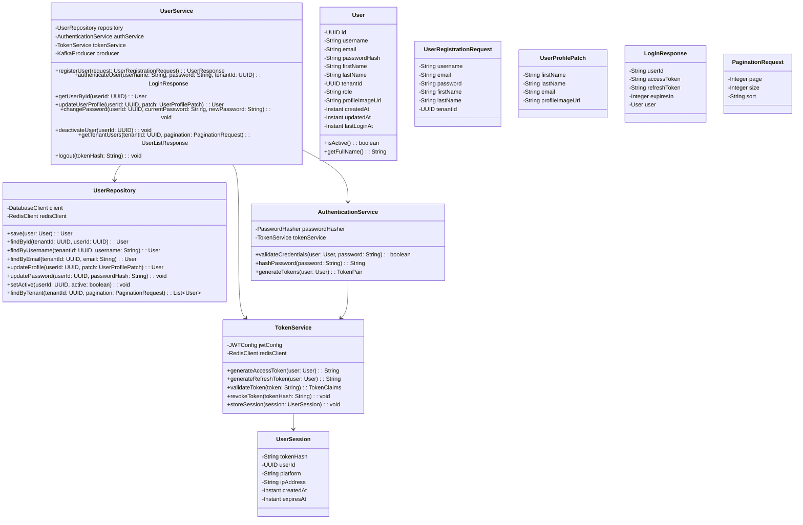

### 6.1 Class Diagram



### 6.2 Contract Documentation

**User Registration**
- Method: POST
- Path: /api/v1/users/register
- Description: Register a new user account with tenant association
- Request:
```json
{
  "username": "string",
  "email": "string",
  "password": "string",
  "firstName": "string",
  "lastName": "string",
  "tenantId": "string"
}
```
- Response:
```json
{
  "userId": "string",
  "username": "string",
  "email": "string",
  "firstName": "string",
  "lastName": "string",
  "tenantId": "string",
  "role": "USER",
  "createdAt": "2025-09-20T10:00:00Z"
}
```

**Login**
- Method: POST
- Path: /api/v1/auth/login
- Description: User authentication endpoint to identify current user session and fetch user data. Response returns userId and tokens.
- Request:
```json
{
  "username": "string",
  "password": "string",
  "tenantId": "string"
}
```
- Response:
```json
{
  "userId": "string",
  "accessToken": "string",
  "refreshToken": "string",
  "expiresIn": 3600,
  "user": {
    "id": "string",
    "username": "string",
    "email": "string",
    "firstName": "string",
    "lastName": "string",
    "tenantId": "string",
    "role": "USER",
    "lastLoginAt": "2025-09-20T10:00:00Z"
  }
}
```

**Get User Profile**
- Method: GET
- Path: /api/v1/users/{userId}
- Description: Retrieve user profile information
- Headers: Authorization: Bearer {accessToken}
- Response:
```json
{
  "id": "string",
  "username": "string",
  "email": "string",
  "firstName": "string",
  "lastName": "string",
  "tenantId": "string",
  "role": "USER",
  "profileImageUrl": "string",
  "createdAt": "2025-09-20T10:00:00Z",
  "lastLoginAt": "2025-09-20T10:00:00Z"
}
```

**Update User Profile**
- Method: PUT
- Path: /api/v1/users/{userId}
- Description: Update user profile information
- Headers: Authorization: Bearer {accessToken}
- Request:
```json
{
  "firstName": "string",
  "lastName": "string",
  "email": "string",
  "profileImageUrl": "string"
}
```
- Response:
```json
{
  "id": "string",
  "username": "string",
  "email": "string",
  "firstName": "string",
  "lastName": "string",
  "tenantId": "string",
  "role": "USER",
  "profileImageUrl": "string",
  "updatedAt": "2025-09-20T10:00:00Z"
}
```

**Change Password**
- Method: POST
- Path: /api/v1/users/{userId}/change-password
- Description: Change user password
- Headers: Authorization: Bearer {accessToken}
- Request:
```json
{
  "currentPassword": "string",
  "newPassword": "string"
}
```
- Response: 204 No Content

**Logout**
- Method: POST
- Path: /api/v1/auth/logout
- Description: Invalidate user session and blacklist token
- Headers: Authorization: Bearer {accessToken}
- Response: 204 No Content

**Get Tenant Users** (Admin only)
- Method: GET
- Path: /api/v1/tenants/{tenantId}/users
- Description: Get all users for a specific tenant
- Headers: Authorization: Bearer {accessToken}
- Query Parameters: page, size, sort
- Response:
```json
{
  "users": [
    {
      "id": "string",
      "username": "string",
      "email": "string",
      "firstName": "string",
      "lastName": "string",
      "role": "USER",
      "createdAt": "2025-09-20T10:00:00Z",
      "lastLoginAt": "2025-09-20T10:00:00Z"
    }
  ],
  "totalElements": 100,
  "totalPages": 10,
  "currentPage": 0,
  "pageSize": 10
}
```
### 6.3 Persistence Model

#### Database Schema Design

#### Table Structures

**USERS Table**
| Column | Type | Size | Not Null | Default | Description |
|--------|------|------|----------|---------|-------------|
| id | UUID | - | YES | gen_random_uuid() | Primary key |
| username | VARCHAR | 50 | YES | - | Unique username |
| email | VARCHAR | 255 | YES | - | User email address |
| password_hash | VARCHAR | 255 | YES | - | Bcrypt hashed password |
| first_name | VARCHAR | 50 | YES | - | User first name |
| last_name | VARCHAR | 50 | YES | - | User last name |
| tenant_id | UUID | - | YES | - | Foreign key to tenants |
| role | VARCHAR | 20 | YES | 'USER' | User role (USER, TENANT_ADMIN) |
| created_at | TIMESTAMP | - | YES | CURRENT_TIMESTAMP | Creation timestamp |
| updated_at | TIMESTAMP | - | YES | CURRENT_TIMESTAMP | Last update timestamp |
| profile_image_url | VARCHAR | 500 | NO | NULL | Profile image URL |

**USER_SESSIONS Table (Redis)**
| Column | Type | Size | Not Null | Default | Description |
|--------|------|------|----------|---------|-------------|
| token_hash | VARCHAR | 255 | YES | - | Hashed token as primary key |
| user_id | UUID | - | YES | - | User reference |
| platform | VARCHAR | 500 | NO | NULL | Device platform (Android, iOS, Web) |
| ip_address | VARCHAR | 45 | NO | NULL | IP address |
| created_at | TIMESTAMP | - | YES | CURRENT_TIMESTAMP | Session creation |
| expires_at | TIMESTAMP | - | YES | - | Session expiration |

#### Main Queries

**User Authentication Query**
```sql
SELECT u.id, u.username, u.email, u.password_hash, u.first_name, u.last_name, 
       u.tenant_id, u.role
FROM users u 
WHERE u.username = ? AND u.tenant_id = ?;
```

**Get Tenant Users Query**
```sql
SELECT u.id, u.username, u.email, u.first_name, u.last_name, u.role, u.created_at
FROM users u 
WHERE u.tenant_id = ? 
ORDER BY u.created_at DESC 
LIMIT ? OFFSET ?;
```

**User Profile Update Query**
```sql
UPDATE users 
SET first_name = ?, last_name = ?, email = ?, profile_image_url = ?, 
    updated_at = CURRENT_TIMESTAMP 
WHERE id = ? AND tenant_id = ?;
```

#### Performance Expectations
- **User Authentication**: < 50ms (with Redis cache: < 5ms)
- **User Profile Retrieval**: < 30ms (with Redis cache: < 2ms)
- **Tenant User Listing**: < 100ms for up to 1000 users per tenant
- **User Creation**: < 100ms

### 6.4 Algorithm/Data Structures

#### Authentication Algorithm
```
Algorithm: User Authentication Flow
Input: username, password, tenantId
Output: LoginResponse with tokens or AuthenticationException

1. VALIDATE_INPUT(username, password, tenantId)
   - Check for null/empty values
   - Validate username format (alphanumeric, 3-50 chars)
   - Validate password complexity
   - Validate tenantId format (UUID)

2. USER_LOOKUP(username, tenantId)
   - Query: SELECT * FROM users WHERE username = ? AND tenant_id = ?
   - Cache check: Redis key "user:{username}:{tenantId}"
   - If cache miss: query database and cache for 5 minutes

3. PASSWORD_VERIFICATION(user, password)
   - Use BCrypt.checkpw(password, user.password_hash)
   - Time-constant comparison to prevent timing attacks

4. TOKEN_GENERATION(user)
   - Generate JWT access token (15 min expiry)
   - Generate refresh token (7 days expiry)
   - Store session in Redis: "session:{access_token_hash}"
```

#### Password Hashing Strategy
```
Algorithm: Secure Password Hashing
Input: plaintext_password
Output: bcrypt_hash

1. SALT_GENERATION()
   - Use BCrypt.gensalt() with work factor 12
   - Work factor chosen to take ~250ms on modern hardware
   - Automatically includes random salt

2. HASH_GENERATION(password, salt)
   - Use BCrypt.hashpw(password, salt)

3. VALIDATION(password, stored_hash)
   - Use BCrypt.checkpw(password, stored_hash)
   - Time-constant comparison prevents timing attacks

Security Properties:
- Adaptive: Can increase work factor as hardware improves
- Salt included: Prevents rainbow table attacks
- Time-constant: Prevents timing attacks
- Recommended by OWASP for password storage
```

#### JWT Token Structure
```
Header:
{
  "alg": "HS256",
  "typ": "JWT"
}

Payload:
{
  "sub": "user_id",
  "username": "username",
  "tenant_id": "tenant_id",
  "role": "USER",
  "iat": 1695199200,
  "exp": 1695199800,
  "jti": "unique_token_id"
}

Signature: HMACSHA256(base64UrlEncode(header) + "." + base64UrlEncode(payload), secret)
```

#### Caching Strategy Data Structures

**Redis Key Patterns:**
```
User Profile Cache:
Key: "user:profile:{user_id}"
Value: JSON serialized User object
TTL: 1800 seconds (30 minutes)

User Session Cache:
Key: "session:{token_hash}"
Value: JSON serialized UserSession object
TTL: 900 seconds (15 minutes)
```
