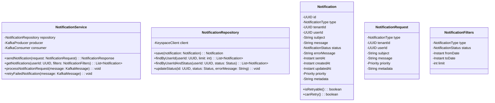

# Notification Service Design

## 6.1 Class Diagram



## 6.2 Contract Documentation

### REST API Endpoints

#### GET /notifications
**Description**: Retrieve notifications for a user with optional filtering
**Headers**:
- `X-Tenant-ID` (UUID, required): Tenant identifier for multi-tenancy
**Input Parameters**:
- `user_id` (UUID, required): User identifier
- `type` (string, optional): Filter by notification type (email, sms, backoffice)
- `status` (string, optional): Filter by status (pending, sent, failed)
- `from_date` (ISO timestamp, optional): Filter from date
- `to_date` (ISO timestamp, optional): Filter to date
- `limit` (int, optional, default=50, max=100): Number of results

**Output**:
```json
{
  "notifications": [
    {
      "id": "uuid",
      "type": "email",
      "tenant_id": "uuid",
      "user_id": "uuid",
      "subject": "string",
      "message": "string",
      "status": "sent",
      "sent_at": "2024-01-01T10:00:00Z",
      "created_at": "2024-01-01T09:59:00Z",
      "priority": "medium",
      "metadata": {}
    }
  ],
  "total": 25,
  "has_more": false
}
```

#### POST /notifications
**Description**: Send a new notification
**Headers**:
- `X-Tenant-ID` (UUID, required): Tenant identifier for multi-tenancy
**Input**:
```json
{
  "type": "email",
  "user_id": "uuid",
  "subject": "string",
  "message": "string",
  "priority": "high",
  "metadata": {
    "template_id": "welcome_email",
    "variables": {"name": "John"}
  }
}
```

**Output**:
```json
{
  "id": "uuid",
  "status": "pending",
  "created_at": "2024-01-01T10:00:00Z"
}
```

### Kafka Topics

#### notifications.request
**Purpose**: Queue notification requests for processing
**Schema**:
```json
{
  "notification_id": "uuid",
  "type": "email",
  "tenant_id": "uuid",
  "user_id": "uuid",
  "subject": "string",
  "message": "string",
  "priority": "medium",
  "metadata": {},
  "created_at": "2024-01-01T10:00:00Z"
}
```

#### notifications.retry
**Purpose**: Handle failed notifications for retry processing
**Schema**:
```json
{
  "notification_id": "uuid",
  "retry_count": 2,
  "last_error": "SMTP timeout",
  "next_retry_at": "2024-01-01T10:05:00Z"
}
```

#### notifications.result
**Purpose**: Publish notification delivery results
**Schema**:
```json
{
  "notification_id": "uuid",
  "status": "sent",
  "sent_at": "2024-01-01T10:01:00Z",
  "error_message": null
}
```

## 6.3 Database Design - AWS Keyspaces

### Table Structure

| NAME            | TYPE                               | SIZE | NOT NULL | DEFAULT             | DESCRIPTION                                                     |
| --------------- | ---------------------------------- | ---- | -------- | ------------------- | --------------------------------------------------------------- |
| `id`            | UUID / BIGINT                      | -    | YES      | -                   | Unique identifier for the notification                          |
| `tenant_id`     | UUID / BIGINT                      | -    | YES      | -                   | Reference to the tenant in user-service                         |
| `user_id`       | UUID / BIGINT                      | -    | YES      | -                   | Reference to the user in user-service                           |
| `type`          | ENUM(`email`, `sms`, `backoffice`) | -    | YES      | -                   | The channel/type of notification                                |
| `subject`       | VARCHAR                            | -    | NO       | NULL                | Optional subject, mostly for email notifications                |
| `message`       | TEXT                               | -    | YES      | -                   | Main content of the notification                                |
| `status`        | ENUM(`pending`, `sent`, `failed`)  | -    | YES      | `pending`           | Delivery status of the notification                             |
| `error_message` | TEXT                               | -    | NO       | NULL                | Optional, stores error if sending failed                        |
| `created_at`    | TIMESTAMP                          | -    | YES      | `CURRENT_TIMESTAMP` | Timestamp when notification was created                         |
| `sent_at`       | TIMESTAMP                          | -    | NO       | NULL                | Timestamp when notification was successfully sent               |
| `updated_at`    | TIMESTAMP                          | -    | YES      | `CURRENT_TIMESTAMP` | Last updated timestamp                                          |
| `priority`      | ENUM(`low`, `medium`, `high`)      | -    | NO       | `medium`            | Optional, for prioritized sending                               |
| `metadata`      | JSON                               | -    | NO       | NULL                | Optional extra data (e.g., template variables, backoffice info) |


```cql
CREATE TABLE notifications (
    id UUID,
    tenant_id UUID,
    user_id UUID,
    type TEXT,
    subject TEXT,
    message TEXT,
    status TEXT,
    error_message TEXT,
    created_at TIMESTAMP,
    sent_at TIMESTAMP,
    updated_at TIMESTAMP,
    priority TEXT,
    metadata TEXT,
    PRIMARY KEY ((tenant_id, user_id), created_at, id)
) WITH CLUSTERING ORDER BY (created_at DESC, id ASC);
```

### Partitioning Strategy
- **Composite Partition Key**: `(tenant_id, user_id)` - Ensures tenant isolation and user-specific queries
- **Clustering Keys**: `created_at DESC, id ASC` - Orders by newest first, with ID for uniqueness
- **Benefits**: 
  - Complete tenant data isolation
  - User-centric access patterns within tenant
  - Time-based ordering for pagination
  - Efficient range queries by date
  - Natural load distribution across tenants

### Secondary Indexes
```cql
CREATE INDEX notifications_status_idx ON notifications (tenant_id, status);
CREATE INDEX notifications_type_idx ON notifications (tenant_id, type);
```

### Main Queries

#### 1. Get User Notifications (Primary Query)
```cql
SELECT * FROM notifications 
WHERE tenant_id = ? AND user_id = ? 
ORDER BY created_at DESC 
LIMIT ?;
```
**Performance**: Single partition read, ~1-5ms latency

#### 2. Get User Notifications by Status
```cql
SELECT * FROM notifications 
WHERE tenant_id = ? AND user_id = ? AND status = ?
ORDER BY created_at DESC 
LIMIT ?;
```
**Performance**: Partition + index scan, ~5-10ms latency

#### 3. Get User Notifications by Date Range
```cql
SELECT * FROM notifications 
WHERE tenant_id = ? AND user_id = ? 
AND created_at >= ? 
AND created_at <= ?
ORDER BY created_at DESC;
```
**Performance**: Single partition with clustering filter, ~2-8ms latency

#### 4. Update Notification Status
```cql
UPDATE notifications 
SET status = ?, error_message = ?, sent_at = ?, updated_at = ?
WHERE tenant_id = ? AND user_id = ? AND created_at = ? AND id = ?;
```
**Performance**: Single row update, ~1-3ms latency

#### 5. Get Tenant Notifications by Status (Admin Query)
```cql
SELECT * FROM notifications 
WHERE tenant_id = ? AND status = ?
LIMIT ?;
```
**Performance**: Index scan across tenant, ~10-20ms latency

## 6.4 Algorithms & Data Structures

### Retry Algorithm - Exponential Backoff
```
retry_delay = base_delay * (2 ^ retry_count) + jitter
max_retries = 5
base_delay = 30 seconds
max_delay = 1800 seconds (30 minutes)
jitter = random(0, 1000ms)

Example progression:
- Retry 1: 30s + jitter
- Retry 2: 60s + jitter  
- Retry 3: 120s + jitter
- Retry 4: 240s + jitter
- Retry 5: 480s + jitter
```

### Priority Queue Data Structure
```
High Priority: Process immediately
Medium Priority: Process within 5 minutes
Low Priority: Process within 30 minutes

Implementation: Kafka partitions with different consumer groups
- notifications.request.high (1 partition, 3 consumers)
- notifications.request.medium (2 partitions, 2 consumers)  
- notifications.request.low (1 partition, 1 consumer)
```

### Pagination Algorithm
```
Token-based pagination using created_at + id:
1. First page: No token required
2. Next page: Use last item's (created_at, id) as token
3. Query: WHERE tenant_id = ? AND user_id = ? AND (created_at, id) < (token_time, token_id)
4. Benefits: Consistent results even with new insertions, tenant isolation maintained
```

### Deduplication Strategy
```
Idempotency Key: SHA-256(tenant_id + user_id + type + message + timestamp_hour)
- Prevents duplicate notifications within 1-hour window
- Stored in Redis with 1-hour TTL
- Tenant-aware deduplication
- Check before processing notification request
```

### Keyspaces Optimization Patterns

#### Batch Operations
```cql
BEGIN BATCH
  INSERT INTO notifications (...) VALUES (...);
  UPDATE tenant_stats SET notification_count = notification_count + 1 WHERE tenant_id = ?;
  UPDATE user_stats SET notification_count = notification_count + 1 WHERE tenant_id = ? AND user_id = ?;
APPLY BATCH;
```

#### Time-based Partitioning Benefits
- Natural data distribution across nodes
- Efficient time-range queries
- Automatic data aging (older partitions can be archived)
- Optimal for notification access patterns (recent notifications accessed most)

#### Consistency Level Strategy
- **Writes**: LOCAL_QUORUM (balance consistency/performance)
- **Reads**: LOCAL_ONE (eventual consistency acceptable for notifications)
- **Critical Updates**: QUORUM (status updates for audit trail)