Here is a first draft of the User Service design document that mirrors the structure, conventions, and tenant-aware patterns used in notification-service-design.md, with clear TBD markers where decisions remain to be finalized.[1]
All sections below intentionally follow the same organization and level of detail so the services feel consistent across the platform.[1]

### Overview
This document proposes the scope, contracts, storage model, and internal patterns for the User Service while keeping the same documentation style and multi-tenant conventions established in the Notification Service design.[1]
Assumptions are explicitly marked as TBD and will be refined in subsequent iterations to stay aligned with shared REST, Kafka, and Keyspaces patterns already in use.[1]

### 6.1 Class Diagram
This class diagram mirrors the composition used in the Notification Service (service layer, repository, Kafka producer/consumer, request/filters types) to preserve consistency and predictability across codebases.[1]
Domain attributes and operations are drafted to support core user lifecycle and profile management, with event-driven interactions patterned after the existing notification flow.[1]

```mermaid
classDiagram
    class UserService {
        -UserRepository repository
        -KafkaProducer producer
        -KafkaConsumer consumer
        +createUser(request: UserRequest): UserResponse  %% TBD: fine-tune fields
        +getUserById(userId: UUID): User
        +searchUsers(filters: UserFilters): List~User~
        +updateUser(id: UUID, patch: UserPatch): User
        +deactivateUser(id: UUID): void
        +processUserEvent(message: KafkaMessage): void
    }

    class UserRepository {
        -KeyspaceClient client
        +save(user: User): User
        +findById(tenantId: UUID, userId: UUID): User
        +searchByFilters(tenantId: UUID, filters: UserFilters, limit: int): List~User~
        +updateFields(tenantId: UUID, userId: UUID, patch: UserPatch): User
        +setActive(tenantId: UUID, userId: UUID, active: boolean): void
    }

    class User {
        -UUID id
        -UUID tenantId
        -String email
        -String displayName
        -String locale
        -String timeZone
        -boolean active
        -Instant createdAt
        -Instant updatedAt
        -String metadata  %% JSON string
        +isActive(): boolean
    }

    class UserRequest {
        -UUID tenantId
        -String email
        -String displayName
        -String locale
        -String timeZone
        -String metadata  %% JSON string
    }

    class UserPatch {
        -String displayName
        -String locale
        -String timeZone
        -boolean active
        -String metadata  %% JSON string
    }

    class UserFilters {
        -String emailLike
        -Boolean active
        -Instant fromCreatedAt
        -Instant toCreatedAt
        -int limit
        -String pageToken
    }
```



### 6.2 Contract Documentation
The REST and Kafka contracts below copy the Notification Service conventions: tenant scoping via X-Tenant-ID, JSON payloads, and token-based pagination patterns for stable reads under write load.[1]
AuthN/AuthZ is integrated at the platform layer and this service focuses on tenant-aware user profile data and lifecycle events, reusing the same error and response shape idioms already established.[1]

#### REST API Endpoints
The following follow the same header and response structure used by the Notification Service, including X-Tenant-ID and predictable envelopes where applicable.[1]

- Headers  
  - X-Tenant-ID (UUID, required): Tenant identifier for multi-tenancy.[1]

- GET /users  
  Description: Search users by optional filters with pagination.[1]
  Query params: email_like, active, from_created_at, to_created_at, limit (default=50, max=100), page_token.[1]
  Output:
  ```json
  {
    "users": [
      {
        "id": "uuid",
        "tenant_id": "uuid",
        "email": "string",
        "display_name": "string",
        "locale": "en-US",
        "time_zone": "UTC",
        "active": true,
        "created_at": "2024-01-01T10:00:00Z",
        "updated_at": "2024-01-01T10:00:00Z",
        "metadata": {}
      }
    ],
    "total": 1,
    "has_more": false,
    "next_page_token": null
  }
  ```


- GET /users/{id}  
  Description: Retrieve a single user by id within the tenant.[1]
  Output mirrors the user item above.[1]

- POST /users  
  Description: Create a new user profile within the tenant.[1]
  Input:
  ```json
  {
    "email": "string",
    "display_name": "string",
    "locale": "en-US",
    "time_zone": "UTC",
    "metadata": {}
  }
  ```
  Output:
  ```json
  { "id": "uuid", "created_at": "2024-01-01T10:00:00Z" }
  ```


- PATCH /users/{id}  
  Description: Partially update profile fields and active status.[1]
  Input:
  ```json
  {
    "display_name": "string",
    "locale": "en-US",
    "time_zone": "UTC",
    "active": true,
    "metadata": {}
  }
  ```
  Output returns the updated user representation.[1]

- DELETE /users/{id}  
  Description: Soft-delete or deactivate a user (TBD exact semantics), returning 204 on success.[1]

#### Kafka Topics
Topic names and JSON schemas follow the same naming, envelope, and timestamp conventions used by the Notification Service’s topics to simplify consumer development across services.[1]

- users.created  
  Purpose: Publish new user creation events for downstream consumers (e.g., provisioning, welcome flows).[1]
  Schema:
  ```json
  {
    "event_id": "uuid",
    "tenant_id": "uuid",
    "user_id": "uuid",
    "email": "string",
    "display_name": "string",
    "active": true,
    "created_at": "2024-01-01T10:00:00Z",
    "metadata": {}
  }
  ```


- users.updated  
  Purpose: Publish profile or status changes for cache invalidation and projections.[1]
  Schema:
  ```json
  {
    "event_id": "uuid",
    "tenant_id": "uuid",
    "user_id": "uuid",
    "changes": { "display_name": "string", "locale": "en-US", "active": true },
    "updated_at": "2024-01-01T10:00:00Z"
  }
  ```


- users.deactivated  
  Purpose: Signal deactivation to dependent services for permission and delivery checks.[1]
  Schema:
  ```json
  {
    "event_id": "uuid",
    "tenant_id": "uuid",
    "user_id": "uuid",
    "reason": "string",
    "deactivated_at": "2024-01-01T10:00:00Z"
  }
  ```


### 6.3 Database Design – AWS Keyspaces
This section applies the same Cassandra/Keyspaces modeling style used by the Notification Service, prioritizing tenant isolation, user-centric access patterns, and time-aware pagination tokens where needed.[1]
Exact indexing and clustering choices are designed to keep primary queries single-partition and to mirror the performance characteristics documented for notifications.[1]

CQL (TBD to finalize types/indices):
```cql
-- Primary table optimized for tenant + userId lookups and email search support (via SAI or auxiliary table)
CREATE TABLE users (
    tenant_id UUID,
    id UUID,
    email TEXT,
    display_name TEXT,
    locale TEXT,
    time_zone TEXT,
    active BOOLEAN,
    created_at TIMESTAMP,
    updated_at TIMESTAMP,
    metadata TEXT,
    PRIMARY KEY ((tenant_id), id)
) WITH CLUSTERING ORDER BY (id ASC);
```

Auxiliary email lookup (choose one approach per platform standards, TBD):
```cql
-- Option A: SAI index (if enabled for Keyspaces flavor in use)
-- CREATE CUSTOM INDEX users_email_idx ON users (email);

-- Option B: Lookup table for exact match
CREATE TABLE users_by_email (
    tenant_id UUID,
    email TEXT,
    id UUID,
    created_at TIMESTAMP,
    PRIMARY KEY ((tenant_id, email))
);
```

Partitioning strategy (aligned with notification patterns):  
- Writes/reads stay tenant-scoped to preserve isolation and predictable latency, with single-partition primary reads by tenant_id + id for the dominant path.[1]
- Email search can be supported via SAI or a tenant-scoped lookup table to avoid cross-tenant scans, echoing the index trade-offs described in the notification design section.[1]

Main queries (examples):
```cql
-- 1) Get user by id (primary path)
SELECT * FROM users WHERE tenant_id = ? AND id = ?;

-- 2) Search by email (exact match path)
SELECT id FROM users_by_email WHERE tenant_id = ? AND email = ?;

-- 3) List users (paged)
-- Use page_token from last (id) or created_at+id if ordering by creation is needed
SELECT * FROM users WHERE tenant_id = ? LIMIT ?;
```


Consistency levels (inherit baseline):  
- Writes: LOCAL_QUORUM for balance of durability and latency, consistent with patterns already documented.[1]
- Reads: LOCAL_ONE for listing and profile fetches where monotonicity is acceptable, and QUORUM for administrative or compliance-sensitive updates mirroring the stricter cases in the notification doc.[1]

### 6.4 Algorithms & Data Structures
This section intentionally reuses proven algorithms from the Notification Service to minimize cognitive load and operational variance across services.[1]
Pagination, idempotency, and deduplication patterns are kept consistent so shared libraries and client behavior remain uniform between services.[1]

- Pagination (token-based)
```
Token = last_seen_id (or last_seen_created_at + id)
1) First page: no token
2) Next page: WHERE tenant_id = ? AND id > token_id  (or tuple comparison if using created_at,id)
3) Benefits: stable pagination under concurrent writes
```


- Idempotency for createUser
```
Idempotency-Key: SHA-256(tenant_id + email)
- Prevents duplicate user creation within a short TTL window
- Checked before persisting new users and before emitting users.created
```


- Event retry with exponential backoff (producer/consumer)
```
retry_delay = base_delay * (2 ^ retry_count) + jitter
max_retries = 5
base_delay = 30s
max_delay = 30m
```


### Next steps
- Confirm the exact ownership boundary with the identity provider and finalize which attributes live in this service versus the IdP (TBD) while keeping REST/Kafka/Keyspaces conventions aligned with the prior service.[1]
- Validate the email indexing strategy (SAI vs lookup table), finalize pagination token choice, and lock topic names and schemas before implementation to maintain parity with existing service standards.[1]

[1](./notification-service-design.md)
[2](./arch_diagram_v2-V12.png)